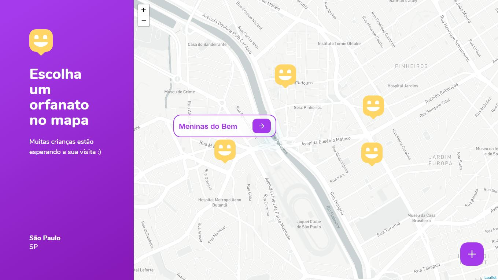

</header>

  

  <h1 align="center" style="font-weigth: bold;"> Happy </h1>
  
 
    <strong>Um Projeto Para Facilitar a Localização dos Centros de Acolhimento Social</strong> 
  

  
 
  <a href="#status">Status</a> |•|
    <a href="#preview">Preview</a> |•|
    <a href="#instalacao">Instalação</a> |•|
    <a href="#tecnologias">Tecnologias</a>
  

  

</header>

<main>
  

    <h3 align="center">Status</h3>
    <h4 align="center">
       ✌(◠‿◠)✌   Em Desenvolvimento   ✌(◠‿◠)✌
    </h4>
  

  

    <h3 align="center">Preview</h3>
    
    
  

  

    <h3 align="center">Instalação</h3>
    
 🍾 É necessário ter o <a href="https://nodejs.org/en/" target="_blank">Node.JS</a> ou o <a href="https://classic.yarnpkg.com/en/" target="_blank">Yarn</a> instalado para seguir os próximos passos 🍾 

          	✯Clonando o Diretório na sua Máquina✯ 
            
      ▶ Clone o repositório
      $ git clone https://github.com/Marciovesk/nlw03
    
      ▶ Vá para o diretório
      $ cd Happy-NLW-3
    
      ▶ Instale todas as dependências
      $ yarn install
    
      ▶ Inicie a Aplicação
      $ yarn start
      
    
      		✯## Rodando o Backend ##✯
    
      ▶ Acesse a pasta backend pelo terminal.
      ▶ Execute: npm run typeorm --migration:run.
    
      ▶ Depois: npm start.
    
        	✯## Rodando o FrontEnd ##✯
    
      ▶ Acesse a pasta do frontend que é a pasta web pelo terminal.
      
      ▶ Execute: npm install.
      ▶ Depois: npm start.
      
     		 ✯## Rodando o Mobile ##✯  		 
    
      ▶ Mantenha o terminal do backend aberto
    
      ▶ Abra um novo terminal, acessa a pasta mobile.
    
      ▶ Execute: npm install.
    
      ▶ Ao finalizar a instalação, 
      ▶ Execute: npm start
      
      ▶ Baixe o Aplicativo Expo na PlayStore ou AplleStore
    	(Através dele irá ver a aplicação mobile no seu celular)
    
      ▶ Aguarde carregar e ira aparecer um QR code, Aponte a camera do expo, para o QR Code no site que irá abrir.

  

  

    <h3 align="center">Tecnologias Utilizadas:</h3>
    <ul>
      <li>React;</li>
      <li>React Native;</li>
      <li>Typescript</li>
      <li>React-leaflet;</li>
      <li>Leaflet;</li>
      <li>Axios;</li>
      <li>TypeORM;</li>
      <li>ExpressJS</li>
      <li>Yup;</li>
      <li>SQLite3;</li>
      <li>Typescript</li>
      <li>Expo</li>
    </ul>
  

</main>

✌(◠‿◠)✌
